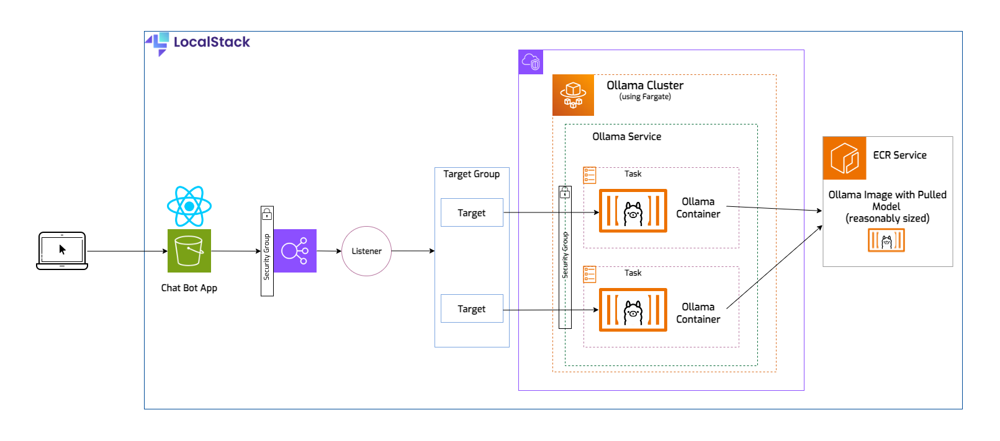
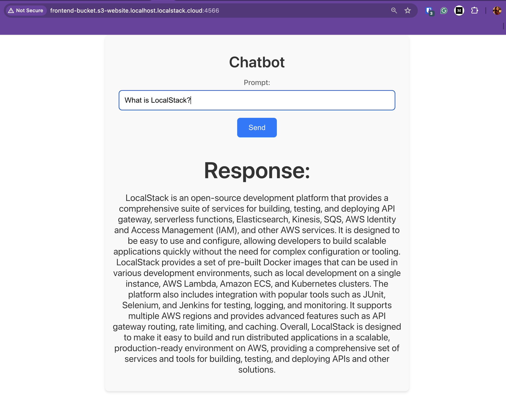
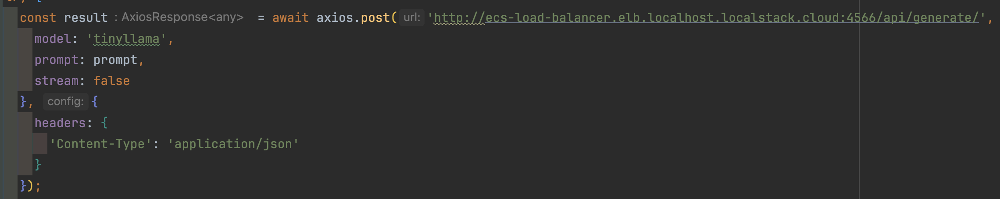

# Local cloud development with Ollama and LocalStack


| Environment      |   |
|------------------|--------------------------------------------------------------------------------------------------------------------------------------------------------------------------------------------------------------------------------------------------------------------------------------------------------------------------------------------------------------------------------------------------------------------------------------------------------------------------------------------------------------------------------------------------------------------------------------------------------------------------------------------------------------------------------------------------------------------------------------------------------------------------------------------------------------------------------------------------------------------------------------------------------------------------------------------------------------------------------------------------------------------------------------------------------------------------------------------------------------------------------------------------------------------------------------------------------------------------------------------------------------------------------------------------------------------------------------------------------------------------------|
| __Services__     | ECS, Fargate, S3, ELB                                                                                                                                                                                                                                                                                                                                                                                                                                                                                                                                                                                                                                                                                                                                                                                                                                                                                                                                                                                                                                                                                                                                                                                                                                                                                                                                                          |
| __Integrations__ | Ollama, AWS CLI                                                                                                                                                                                                                                                                                                                                                                                                                                                                                                                                                                                                                                                                                                                                                                                                                                                                                                                                                                                                                                                                                                                                                                                                                                                                                                                                                                |
| __Categories__   | AI, Chatbot                                                                                                                                                                                                                                                                                                                                                                                                                                                                                                                                                                                                                                                                                                                                                                                                                                                                                                                                                                                                                                                                                                                                                                                                                                                                                                                                                                    |
| __Level__        | Intermediate                                                                                                                                                                                                                                                                                                                                                                                                                                                                                                                                                                                                                                                                                                                                                                                                                                                                                                                                                                                                                                                                                                                                                                                                                                                                                                                                                                   |
| __Works on__     | LocalStack v3                                                                                                                                                                                                                                                                                                                                                                                                                                                                                                                                                                                                                                                                                                                                                                                                                                                                                                                                                                                                                                                                                                                                                                                                                                                                                                                                                                  |


## Introduction

In today’s tech landscape, large language models (LLMs) and AI are transforming both tech-centric and traditional businesses. 
AI functionality is being integrated across various platforms to enhance user experience. A common application are chatbots — tools that 
allow users to query information in their natural language. For instance, on a government website, instead of navigating through numerous menus,
you can simply ask a chatbot for the specific form you need. This tutorial will guide you through setting up such a chatbot using 
Ollama. We will start off by creating the entire stack locally  with LocalStack, and proceed to deploying it to the cloud.

## Prerequisites

- [AWS free tier account](https://aws.amazon.com/free/)
- [LocalStack](https://localstack.cloud/)
- [Docker](https://docs.docker.com/get-docker/) - for running LocalStack
- [AWS CLI](https://docs.aws.amazon.com/cli/latest/userguide/getting-started-install.html) and [AWS CLI local](https://github.com/localstack/awscli-local)
- [npm](https://docs.npmjs.com/downloading-and-installing-node-js-and-npm) - for building the frontend app

## Architecture Overview

We will explore a comprehensive example of running Ollama on ECS Fargate. This example includes a backend with a VPC, a load balancer,
multiple security groups, and an ECR service hosting our image. For simplicity, the frontend application will be a basic chat interface 
with a prompt field and an answer box.



Now, the React application could make a direct request to our Ollama container, but in the real world it's not likely that you would run
just one task and certainly not trying to access the container using its IP address. Ideally you should have multiple tasks running to ensure 
high availability, in case one of them encounters an issue, you can always rely on the others to take over. In front of the tasks you'll need
an application load balancer to handle the HTTP requests. This is how traffic is distributed across the containers. The load balancer will
have a listener, which listens for client requests. The requests are routed to targets, which will be the IPs for the tasks/containers. The
targets live in a target group, which allows us to make configurations for all of them (for example, setting a routing algorithm, or healthcheck
related configs).
Our load balancer needs a security group that allows inbound traffic, and a second security group that only allows incoming traffic
from the load balancer to the ECS service, which will run two tasks. 

## Why Ollama & Tinyllama


Using Ollama with LocalStack for local development of cloud applications offers several advantages:

- Complete Local Development Environment: Combining Ollama and LocalStack allows developers to run complex cloud applications 
entirely on their local machines. Ollama can handle large language models locally, while LocalStack simulates AWS services, 
creating a comprehensive and integrated local development environment.
- Cost Efficiency: Running applications locally avoids the costs associated with cloud resources during development and testing. 
This is particularly useful when working with large language models that can be resource-intensive and expensive to run in the cloud.

- Faster Iteration Cycles: Local development with Ollama and LocalStack allows for rapid prototyping and testing. Developers can
quickly make changes and see results without the delay of deploying to the cloud. This speeds up the development cycle significantly.

- Consistent Development and Production Environments: By using LocalStack to emulate AWS services, developers can ensure that their
local development environment closely matches the production environment. This reduces the risk of environment-specific bugs and 
improves the reliability of the application when deployed to the actual cloud.

- Improved Testing Capabilities: LocalStack provides a robust platform for testing AWS services, including ECS and Fargate. 
Running Ollama as a Fargate task on LocalStack allows for testing complex deployment scenarios and interactions with other AWS 
services, ensuring that the application behaves as expected before deploying to the cloud.

- Enhanced Machine Learning Workflows: Ollama’s capability to run large language models locally means that developers can integrate 
advanced machine learning workflows into their applications. For example, they can use Ollama for natural language processing tasks, 
and test these workflows in a simulated cloud environment provided by LocalStack.

Tinyllama is compact yet powerful, making it an ideal choice for development and testing, particularly with applications demanding a restricted
computation and memory footprint. Depending on your needs, you can replace it with a more specialized model.

## Running the application on LocalStack

### Building the React app

In the `localstack` folder, there’s a directory called `frontend`. To build the React application, navigate to this directory and run 
the following commands:

```bash
cd frontend/chatbot/
npm install
npm run build
```

Notice the creation of the `build` folder. The `npm run build` command is used in React applications to create an optimized, 
production-ready version of your app. This command is responsible for transpilation into a more widely supported format, bundling of resources,
optimizations and minifications.

The build folder is essential for deployment because it contains the static assets needed to run your React app in a production environment. 
These files will be uploaded to the S3 bucket.

### Creating the stack

Now we can run the bash script containing AWS CLI commands to create the necessary resources. Let’s first have a look at some of the 
commands in the script and identify some of the resources they create:

Create the VPC:

```bash
export VPC_ID=$(awslocal ec2 create-vpc --cidr-block 10.0.0.0/16 | jq -r '.Vpc.VpcId')
````
Creates a Virtual Private Cloud (VPC) with a specified CIDR block.

```bash
export SUBNET_ID1=$(awslocal ec2 create-subnet --vpc-id $VPC_ID --cidr-block 10.0.1.0/24 --availability-zone us-east-1a | jq -r '.Subnet.SubnetId')
export SUBNET_ID2=$(awslocal ec2 create-subnet --vpc-id $VPC_ID --cidr-block 10.0.2.0/24 --availability-zone us-east-1b | jq -r '.Subnet.SubnetId')
```
Creates two subnets within the VPC, each in a different availability zone.

```bash
export INTERNET_GW_ID=$(awslocal ec2 create-internet-gateway | jq -r '.InternetGateway.InternetGatewayId')
awslocal ec2 attach-internet-gateway --internet-gateway-id $INTERNET_GW_ID --vpc-id $VPC_ID
```
Creates an internet gateway and attaches it to the VPC.

```bash
export RT_ID=$(awslocal ec2 create-route-table --vpc-id $VPC_ID | jq -r '.RouteTable.RouteTableId')
awslocal ec2 associate-route-table --route-table-id $RT_ID --subnet-id $SUBNET_ID1
awslocal ec2 associate-route-table --route-table-id $RT_ID --subnet-id $SUBNET_ID2
awslocal ec2 create-route --route-table-id $RT_ID --destination-cidr-block 0.0.0.0/0 --gateway-id $INTERNET_GW_ID
```
Creates a route table, associates it with the subnets, and adds a route to the internet gateway.

```bash
export SG_ID1=$(awslocal ec2 create-security-group --group-name ApplicationLoadBalancerSG --description "Security Group of the Load Balancer" --vpc-id $VPC_ID | jq -r '.GroupId')
awslocal ec2 authorize-security-group-ingress --group-id $SG_ID1 --protocol tcp --port 80 --cidr 0.0.0.0/0

export SG_ID2=$(awslocal ec2 create-security-group --group-name ContainerFromLoadBalancerSG --description "Inbound traffic from the First Load Balancer" --vpc-id $VPC_ID | jq -r '.GroupId')
awslocal ec2 authorize-security-group-ingress --group-id $SG_ID2 --protocol tcp --port 0-65535 --source-group $SG_ID1
```
Creates security groups for the load balancer and containers, allowing necessary traffic.

```bash
export LB_ARN=$(awslocal elbv2 create-load-balancer --name ecs-load-balancer --subnets $SUBNET_ID1 $SUBNET_ID2 --security-groups $SG_ID1 --scheme internet-facing | jq -r '.LoadBalancers[0].LoadBalancerArn')
export TG_ARN=$(awslocal elbv2 create-target-group --name ecs-targets --protocol HTTP --port 11434 --vpc-id $VPC_ID --target-type ip --health-check-protocol HTTP --region us-east-1 --health-check-path / | jq -r '.TargetGroups[0].TargetGroupArn')

awslocal elbv2 create-listener --load-balancer-arn $LB_ARN --protocol HTTP --port 11434 --default-actions Type=forward,TargetGroupArn=$TG_ARN
```
Creates an internet-facing load balancer and a target group, and sets up a listener to forward traffic.

```bash
awslocal ecr create-repository --repository-name ollama-service
export MODEL_NAME=tinyllama
docker build --build-arg MODEL_NAME=$MODEL_NAME -t ollama-service .
docker tag ollama-service:latest 000000000000.dkr.ecr.us-east-1.localhost.localstack.cloud:4510/ollama-service:latest
docker push 000000000000.dkr.ecr.us-east-1.localhost.localstack.cloud:4510/ollama-service:latest
```
Creates an ECR repository, builds the Docker image, and pushes it to the repository.

```bash
awslocal ecs create-cluster --cluster-name OllamaCluster

awslocal iam create-role --role-name ecsTaskRole --assume-role-policy-document file://ecs-task-trust-policy.json
export ECS_TASK_PARN=$(awslocal iam create-policy --policy-name ecsTaskPolicy --policy-document file://ecs-task-policy.json | jq -r '.Policy.Arn')
awslocal iam attach-role-policy --role-name ecsTaskRole --policy-arn $ECS_TASK_PARN
awslocal iam update-assume-role-policy --role-name ecsTaskRole --policy-document file://ecs-cloudwatch-policy.json

awslocal iam create-role --role-name ecsTaskExecutionRole --assume-role-policy-document file://ecs-trust-policy.json
export ECS_TASK_EXEC_PARN=$(awslocal iam create-policy --policy-name ecsTaskExecutionPolicy --policy-document file://ecs-task-exec-policy.json | jq -r '.Policy.Arn')
awslocal iam attach-role-policy --role-name ecsTaskExecutionRole --policy-arn $ECS_TASK_EXEC_PARN
awslocal iam update-assume-role-policy --role-name ecsTaskExecutionRole --policy-document file://ecs-cloudwatch-policy.json
```
Creates an ECS cluster and IAM roles with necessary policies for task execution.

```bash
awslocal logs create-log-group --log-group-name ollama-service-logs
awslocal ecs register-task-definition --family ollama-task --cli-input-json file://task_definition.json
```
Creates a CloudWatch log group and registers the ECS task definition.

```bash
awslocal ecs create-service \
--cluster OllamaCluster \
--service-name OllamaService \
--task-definition ollama-task \
--desired-count 2 \
--launch-type FARGATE \
--network-configuration "awsvpcConfiguration={subnets=[$SUBNET_ID1,$SUBNET_ID2],securityGroups=[$SG_ID2],assignPublicIp=ENABLED}" \
--load-balancers "targetGroupArn=$TG_ARN,containerName=ollama-container,containerPort=11434"
```
Creates an ECS service with the specified configuration, linking it to the load balancer.

```bash
awslocal s3 mb s3://frontend-bucket
awslocal s3 website s3://frontend-bucket --index-document index.html
awslocal s3api put-bucket-policy --bucket frontend-bucket --policy file://bucket-policy.json
awslocal s3 sync ./frontend/chatbot/build s3://frontend-bucket
```
Creates an S3 bucket, configures it as a website, sets the bucket policy, and syncs the frontend build to the bucket.

If you decide to use the AWS console to create all your resources, some of the complexity of these commands will be abstracted, and
some even will be created as dependencies of other resources.

You can run the full `commands.sh` script and watch the LocalStack logs for the resources to be created.

```bash
bash commands.sh
```

### Using the app locally

Now that everything is deployed, you can go to the frontend application and try it out. In your browser, navigate to
`http://frontend-bucket.s3-website.us-east-1.localhost.localstack.cloud:4566/` and start typing your question. It takes a few seconds, and then
the full answer appears:



If you look at the `App.js`, located in `frontend/chatbot/src`, you'll notice the POST call payload contains a field `stream: false`.
For simplicity purpose we're going to receive our answer from the LLM "in bulk", rather than streamed, which could take a few seconds to
receive it.




